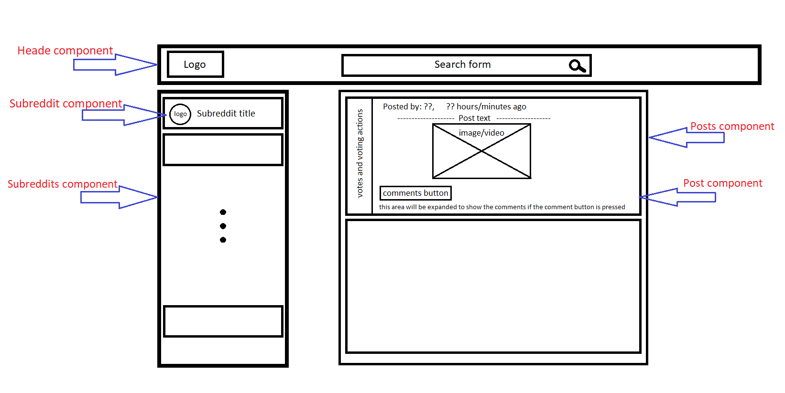

# RedditMinimal
## Overview

RedditMinimal is a simplified Reddit app built using Reddit API. This application allows users to view and search posts and comments provided by the API based on the selected subreddit topic. 

## Project features

* Users can use the application on any device (desktop to mobile)
* Users can use the application on any modern browser
* Users can access the application at a [URL](https://reddit-min-khaledkanaan.netlify.app/)
* Users see an initial view of the data when first visiting the app
* Users can search the data using terms
* Users can filter the data based on categories that are predefined
* Users are shown a detailed view (modal or new page/route) when they select an item
* Users are delighted with a cohesive design system
* Users are delighted with animations and transitions
* Users are able to leave an error state

## Used technologies

* React
* Redux
* HTML
* CSS
* JavaScript
* Git and GitHub
* Command line and file navigation
* Wireframing

## Project planning and wireframing

The application consists of three main components: Header, Subreddits and Posts:

### The Header
The Header is a React component within an html header element and contains the logo+title of the application, the menu button (hidden on big screens) and the search form

### The Subreddits navigator
The Subreddits is a react component within an html aside element that displays all the retrieved Subreddits.
For each subreddit retrieved from Reddit JSON API a new Subreddit react component will be displayed within the Subreddits component, and will be showing the title of the subreddit, the logo and the selection status

### The Posts
The Posts is a react component within an html section element that displays all the retrieved Posts
For each post retrieved from Reddit JSON API a new Post react component will be displayed within the Subreddits component, and will be showing all the details of the post (votes, posted by, timing, media, number of comments...). the comments on the post will also be attached to the Post component (initially hidden) and will be shown/hidden when the user clicks on the comment button.

### Wireframe


## Reddit API

RedditMinimal uses the [Reddit JSON API](https://github.com/reddit-archive/reddit/wiki/JSON). 

Note that Reddit has 2 APIs: [the official API](https://www.reddit.com/dev/api/) and an [undocumented JSON API](https://github.com/reddit-archive/reddit/wiki/JSON). Using the JSON API does have limitations such as no write operations. For the purposes of this project, I found the JSON API adequate.

You can take any Reddit URL, add .json at the end of it, and get JSON. For example, if you want to get the Popular page data in JSON:

Original URL: https://www.reddit.com/r/popular/
JSON URL: https://www.reddit.com/r/popular.json
If you want to search for “cake recipes”:

Original URL: https://www.reddit.com/search?q=cake%20recipes
JSON URL: https://www.reddit.com/search.json?q=cake%20recipes
Notice here .json was not added at the end of the URL. It's actually added before the start of the query string. Refer to [this article](https://www.quora.com/What-are-the-parts-of-a-URL) for a breakdown of the structure of a URL.

### Retrieve all the Subreddits array
To retrieve an array of all the Subreddits objects a fetch with GET request to 'https://www.reddit.com/subreddits.json' should be executed as follows: 
```javascript
const response = await fetch(`https://www.reddit.com/subreddits.json`);
```
The response should be parsed into a JSON as follows: 
```javascript
const jsonResponse = await response.json();
```
An array of all the Subreddits objects can be found at jsonResponse.data.children:
```javascript
return jsonResponse.data.children;
```

### Retrieve all the Subreddits array
To retrieve an array of all the Subreddits objects a fetch with GET request to 'https://www.reddit.com/subreddits.json' should be executed as follows: 
```javascript
const response = await fetch(`https://www.reddit.com/subreddits.json`);
```
The response should be parsed into a JSON as follows: 
```javascript
const jsonResponse = await response.json();
```
An array of all the Subreddits objects can be found at jsonResponse.data.children:
```javascript
return jsonResponse.data.children;
```

The full function should look like: 
```javascript
export const getSubreddits = async () => {
    const response = await fetch(`https://www.reddit.com/subreddits.json`);
    const jsonResponse = await response.json();
    return jsonResponse.data.children;
}
``` 

### Retrieve all Posts related to a given Subreddit
To retrieve an array of all the Posts within a Subreddit topic a fetch with GET request to 'https://www.reddit.com/r/${subreddit}.json' should be executed as follows: 
```javascript
const response = await fetch(`https://www.reddit.com/r/${subreddit}.json`);
```
The response should be parsed into a JSON as follows: 
```javascript
const jsonResponse = await response.json();
```
An array of all the Posts objects can be found at jsonResponse.data.children:
```javascript
return jsonResponse.data.children;
```

The full function should look like: 
```javascript
export const getSubredditPosts = async (subreddit) => {
    const response = await fetch(`https://www.reddit.com/r/${subreddit}.json`);
    const jsonResponse = await response.json();
    return jsonResponse.data.children;
}
``` 
